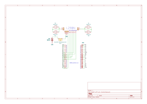

# 🚗 ESP32 Web-Controlled Dual-Mode Robotic Vehicle

An embedded IoT robotics project featuring an ESP32-based vehicle controlled via an asynchronous responsive web interface. Supports dual Wi-Fi operational modes (Access Point & Station), dual-axis joystick/button controls, fail-safe watchdog protection, and real-time telemetry.

---

## 📌 Key Features

- **Dual Wi-Fi Architecture:** 
  - **Access Point (AP) Mode (Default):** Generates its own standalone Wi-Fi network (`ESP32-Car` at `192.168.4.1`) without requiring an external router.
  - **Station (STA) Mode:** Connects to existing WLAN networks for remote access and extended range.
- **Fail-Safe Watchdog Protection:** Automatically halts motor output if the connection is interrupted or the browser is closed for longer than 1.5 seconds.
- **Responsive Multi-Page Web Dashboard:**
  - **D-Pad Controls (`/`):** Touch-optimized directional controls with global PWM speed configuration.
  - **Touch Joystick (`/joystick`):** 360-degree analog joystick with differential motor mixing algorithm ($Left = Y + X$, $Right = Y - X$) and client-side 100ms request throttling.
  - **Telemetry Graph (`/graph`):** Real-time RSSI signal monitoring with signal reliability thresholds.
- **Modern Hardware PWM:** Fully compatible with ESP32 Arduino Core 3.x using native `ledcAttach` architecture.

---

## 🛠️ Hardware & Pinout Configuration

| Component | ESP32 GPIO | Description |
| :--- | :--- | :--- |
| **L298N IN1** | `GPIO 27` | Left Motor Direction 1 |
| **L298N IN2** | `GPIO 26` | Left Motor Direction 2 |
| **L298N IN3** | `GPIO 32` | Right Motor Direction 1 |
| **L298N IN4** | `GPIO 33` | Right Motor Direction 2 |
| **L298N ENA** | `GPIO 25` | Left Motor Speed (PWM @ 1kHz) |
| **L298N ENB** | `GPIO 14` | Right Motor Speed (PWM @ 1kHz) |
| **Common GND**| `GND` | Common Logic Ground |

### ⚡ Power Distribution
- **Logic Power:** ESP32 powered via 5V regulated logic / USB.
- **Motor Power:** 2x 18650 Li-ion batteries (7.4V - 8.4V nominal) connected to L298N 12V terminal.
- *Note:* Common ground (GND) is shared across ESP32 and motor driver.

---

## 📐 Circuit Schematic

Designed using **KiCad EDA**.



---

## 📂 Project Structure

```text
├── 7x7x7 box.stl.stl          # Enclosure CAD model
├── L298N Holder.stl.stl       # Motor driver mounting bracket
├── TT Motor Tutucu.stl.STL    # Gear motor chassis mounts
├── esp32-wifi-car-circuit.svg # KiCad hardware schematic
├── kaynak/                    # Embedded source code directory
│   └── esp32_wifi_car.ino     # Main C++/Arduino firmware
└── README.md                  # Project documentation
---

## 🚀 Getting Started

### 1. Flashing Firmware
1. Open `kaynak/esp32_wifi_car.ino` in Arduino IDE.
2. Select your ESP32 board (e.g., `ESP32 Dev Module`).
3. Ensure ESP32 Board Package version is **3.x+**.
4. Upload the sketch.

### 2. Connecting & Driving
1. Power up the vehicle.
2. Connect your phone/PC to Wi-Fi SSID: `ESP32-Car` (Password: `password123`).
3. Open your browser and navigate to: `[http://192.168.4.1](http://192.168.4.1)`

---

## 📜 Acknowledgements & Credits
- 3D printable mechanical mounting components sourced via [Thingiverse](https://www.thingiverse.com/).
